# 移动端

## 导读

移动端适配，是我们在开发中经常会遇到的，这里面可能会遇到非常多的问题：

- 1px 问题
- UI 图完美适配方案
- iPhoneX 适配方案
- 高清屏图片模糊问题
- ...

接下来我们从移动端适配的基础概念出发，探究移动端适配各种问题的解决方案和实现原理

## 一、英寸

一般用英寸描述屏幕的物理大小，如电脑的 13、16，手机显示器的 4.8、5.7 等使用的单位都是英寸。

需要注意，**上面的尺寸都是屏幕对角线的长度**：

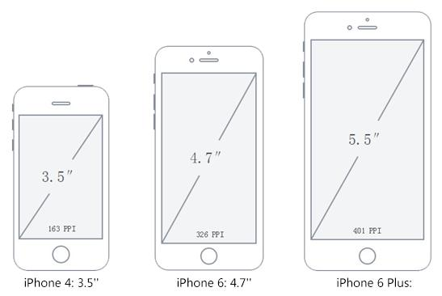

`英寸(inch,缩写为in)`在荷兰语中的本意是大拇指，一英寸就是指甲底部普通人拇指的宽度。

英寸和厘米的换算：1 英寸 = 2.54 厘米

## 二、分辨率

### 2.1 像素

像素即一个小方块，它具有特定的位置和颜色。

图片、电子屏幕（手机、电脑）就是由无数个具有特定颜色和特定位置的小方块拼接而成。

像素可以作为图片或电子屏幕的最小组成单位。

下面我们使用`sketch`打开一张图片：
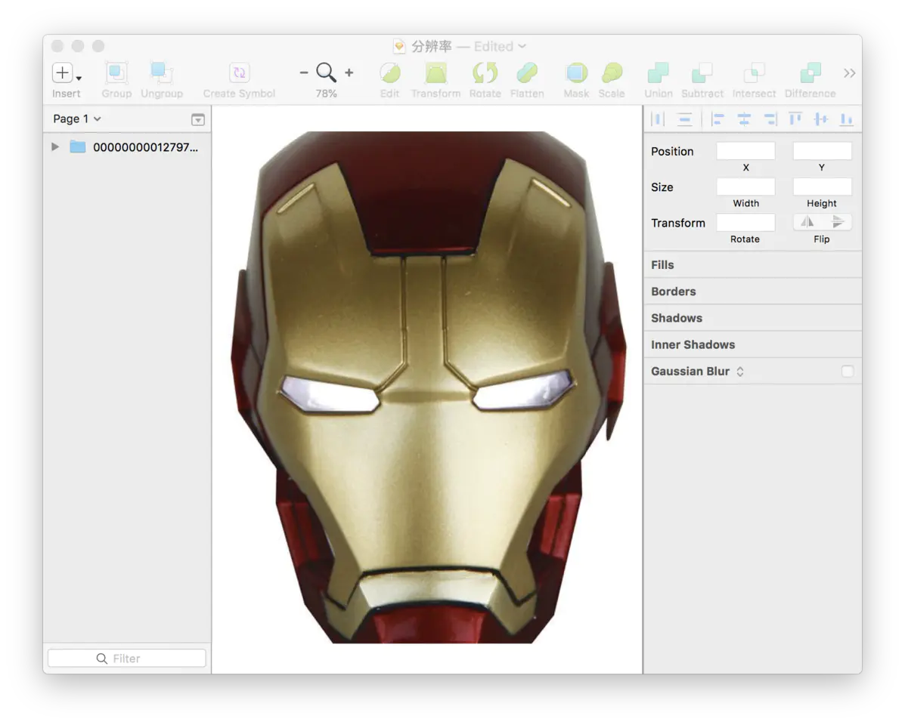

将这些图片放大即可看到这些像素点：

通常我们所说的分辨率有两种，屏幕分辨率和图像分辨率。

### 2.2 屏幕分辨率

屏幕分辨率指一个屏幕具体由多少个像素点组成。

下面是`apple`的官网上对手机分辨率的描述：
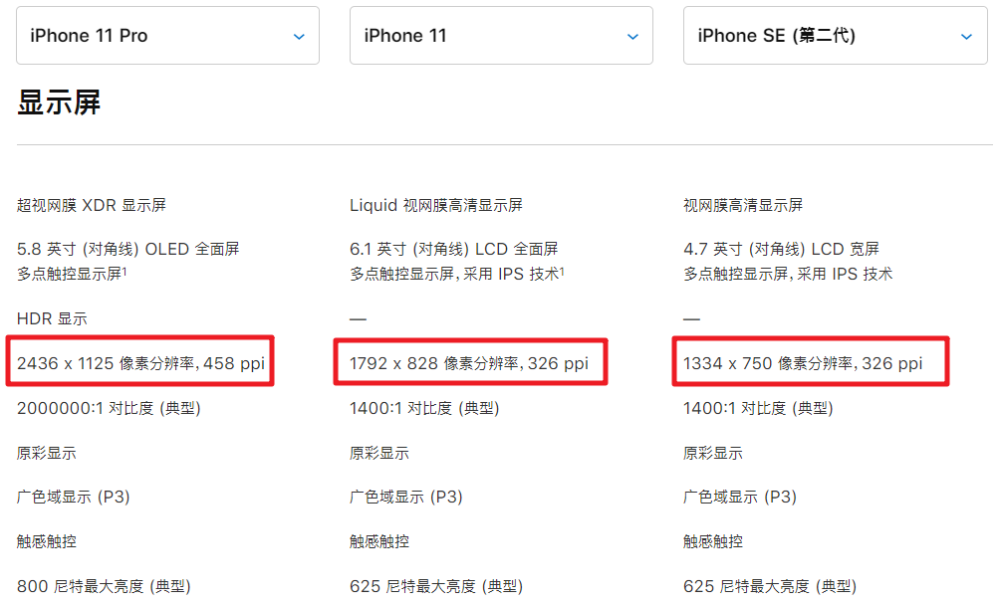

上面分辨率表示手机分别在垂直和水平上所具有的像素点数。

当然分辨率高不代表屏幕就清晰，屏幕的清晰程度还与尺寸有关。

### 2.3 图像分辨率

我们通常说的`图片分辨率`其实是指图片含有的像素数，比如一张图片的分辨率为 800 x 400。这表示图片分别在垂直和水平上所具有的像素点数为 800 和 400。

同一尺寸的图片，分辨率越高，图片越清晰。
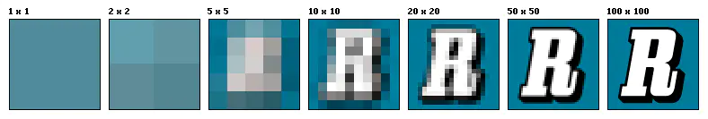

### 2.4 PPI

`PPI(Pixel Per Inch)`：每英寸包括的像素数。

PPI 可以用于描述屏幕的清晰度以及一张图片的质量。

使用 PPI 描述图片时，PPI 越高，图片质量越高，使用 PPI 描述屏幕时，PPI 越高，屏幕越清晰。

在上面描述手机分辨率的图片中，我们可以看到：iPhone 11 Pro 和 iPhone 11 的 PPI 分别为 458 和 326，这足以证明前者的屏幕更清晰。

由于手机尺寸为手机对角线的长度，我们通常使用如下的方法计算 PPI:
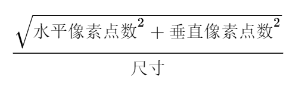


苹果曾经给出个一个标准：手机屏幕达到 300PPI、平板屏幕达到 220PPI、笔记本电脑屏幕达到 200PPI 即可认为是 Retina 屏幕。

## 三、像素

### 3.1 物理像素

物理像素又称设备像素, 是显示器中最小的物理单元，设备能控制显示的最小单位。每个像素根据操作系统的指示设置自己的颜色和亮度。
上面所说的像素都是物理像素。

**任何设备的物理像素数量都是固定的。**

### 3.2 设备独立像素

由程序使用并控制的虚拟像素，比如 web 编程中的 CSS 像素(px)、安卓（dp）、ios 系统(pt)中的设备独立像素.

下面我们来看看`设备独立像素`究竟是如何产生的：

智能手机发展非常之快，在几年之前，我们还用着分辨率非常低的手机，比如下面左侧的白色手机，它的分辨率是 320x480，我们可以在上面浏览正常的文字、图片等等。

但是，随着科技的发展，低分辨率的手机已经不能满足我们的需求了。很快，更高分辨率的屏幕诞生了，比如下面的黑色手机，它的分辨率是 640x940，正好是白色手机的两倍。

理论上来讲，在白色手机上相同大小的图片和文字，在黑色手机上会被缩放一倍，因为它的分辨率提高了一倍。这样，岂不是后面出现更高分辨率的手机，页面元素会变得越来越小吗？

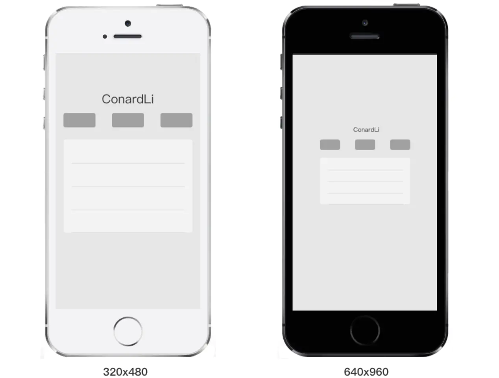

然而，事实并不是这样的，我们现在使用的智能手机，不管分辨率多高，他们所展示的界面比例都是基本类似的。

乔布斯在 iPhone4 的发布会上首次提出了 Retina Display(视网膜屏幕)的概念，它正是解决了上面的问题，这也使它成为一款跨时代的手机。

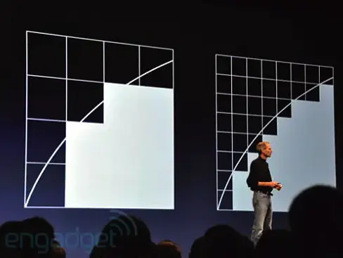

在 iPhone4 使用的视网膜屏幕中，把 2x2 个像素当 1 个像素使用，这样让屏幕看起来更精致，但是元素的大小却不会改变。

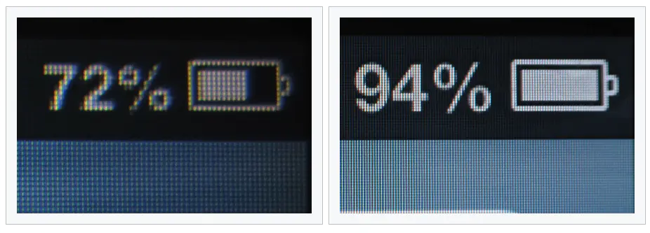

如果黑色手机使用了视网膜屏幕的技术，那么显示结果应该是下面的情况，比如列表的宽度为 300 个像素，那么在一条水平线上，白色手机会用 300 个物理像素去渲染它，而黑色手机实际上会用 600 个物理像素去渲染它。

我们必须用一种单位来同时告诉不同分辨率的手机，它们在界面上显示元素的大小是多少，这个单位就是设备独立像素(Device Independent Pixels)简称 DIP 或 DP。上面我们说，列表的宽度为 300 个像素，实际上我们可以说：列表的宽度为 300 个设备独立像素。

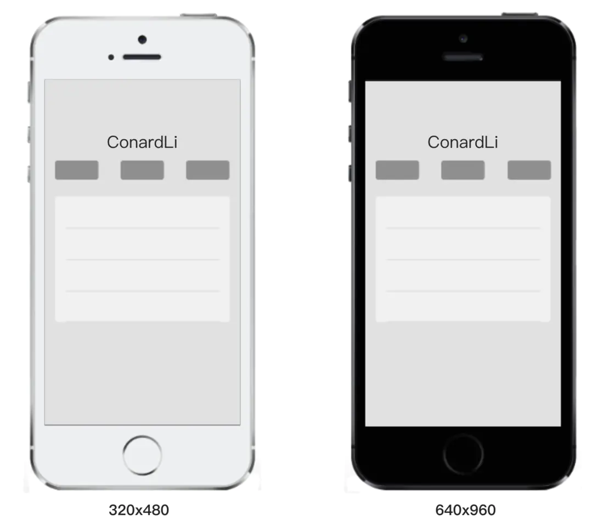

打开 chrome 的开发者工具，我们可以模拟各个手机型号的显示情况，每种型号上面会显示一个尺寸，比如 iPhone X 显示的尺寸是 375x812，实际 iPhone X 的分辨率会比这高很多，这里显示的就是设备独立像素。


### 3.3 物理像素与设备独立像素

物理像素与设备独立像素有一定的对应关系，我们编程时控制的是设备独立像素（比如 css 像素），然后由相关系统转换为物理像素。

### 3.4 设备像素比

设备像素比 device pixel ratio 简称 dpr，即物理像素和设备独立像素的比值。

在 js 中可以通过 window.devicePixelRatio 获取，也可以重写 window.devicePixelRatio 来更改 dpr

在 css 中可以使用媒体查询 device-pixel-ratio:

```css
@media (-webkit-min-device-pixel-ratio: 2), (min-device-pixel-ratio: 2) {
}
```

常见的设备像素比：

| 设备名称                     | 物理像素                | 设备独立像素 | dpr |
| ---------------------------- | ----------------------- | ------------ | --- |
| iPhone 2G, 3G, 3GS           | 320 \* 480              | 320 \* 480   | 1   |
| iPhone 4, 4S                 | 640 \* 960              | 320 \* 480   | 2   |
| iPhone 5, 5S                 | 640 \* 1136             | 320 \* 568   | 2   |
| iPhone 6, 7, 8               | 750 \* 1334             | 375 \* 667   | 2   |
| iPhone 6 Plus, 7 Plus, 8Plus | 1080 \* 1920(2208x1242) | 414 \* 736   | 3   |
| iPhone X                     | 1125 \* 2436            | 375 \* 812   | 3   |

Andriod 设备像素比非常混乱，有 1、1.5、1.75 等，所以可以看做 1
设备设备像素比网址：https://uiiiuiii.com/screen/

### 3.5 位图像素

位图像素是基于栅格的图像（JPG、PNG、GIF）中最小的单位，每个像素都包含屏幕上的显示信息，如位置、颜色等，有的图像信息还包含不透明度（Alpha Channel）。

位图像素也是一个长度单位。位图像素是栅格图像（如：png，jpg，gif 等）最小的数据单元。

**1 个位图像素对应 1 个物理像素**，否则图片就会模糊

思考题：

普通屏下（设备像素比为 1）, 要显示 200x200 像素（这是 css 像素）的元素，设置 css 像素 200x200，实际物理像素 200x200

retina 屏下（设备像素比为 2）, 要显示 200x200 （这是 css 像素）大小的元素, 设置 CSS 像素 200x200, 实际物理像素 400x400

现在假设有一个场景：要展示 200 x 200 像素的图像（这是 css 像素）

普通屏下（设备像素比为 1）, 要显示 200x200 大小的元素，设置 css 像素 200x200

retina 屏下（设备像素比为 2）, 要显示 200x200 大小的元素, 设置 CSS 像素 200x200，图片像素应为 400x400， 才能高清

## 四、视口

视口(viewport)代表当前可见的计算机图形区域。在 Web 浏览器术语中，通常与浏览器窗口相同，但不包括浏览器的 UI， 菜单栏等——即指你正在浏览的文档的那一部分。

一般我们所说的视口共包括三种：布局视口、视觉视口和理想视口，它们在屏幕适配中起着非常重要的作用。

### 4.1 布局视口

布局视口(layout viewport)：当我们以百分比来指定一个元素的大小时，它的计算值是由这个元素的包含块计算而来的。当这个元素是最顶级的元素时，它就是基于布局视口来计算的。
所以，布局视口是网页布局的基准窗口，在 PC 浏览器上，布局视口就等于当前浏览器的窗口大小（不包括 borders 、margins、滚动条）。

在移动端，布局视口被赋予一个默认值，大部分为 980px，这保证 PC 的网页可以在手机浏览器上呈现，但是非常小，用户可以手动对网页进行放大。

我们可以通过调用 document.documentElement.clientWidth / clientHeight 来获取布局视口大小。

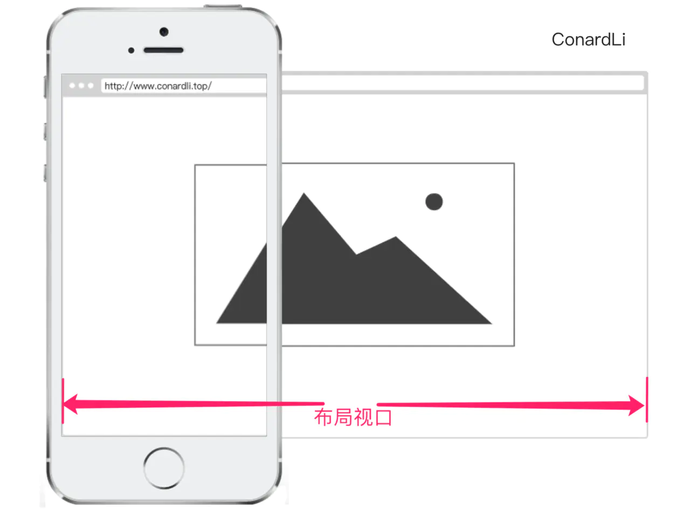

### 4.2 视觉视口

视觉视口(visual viewport)：用户通过屏幕真实看到的区域。
视觉视口默认等于当前浏览器的窗口大小（包括滚动条宽度）。

当用户对浏览器进行缩放时，不会改变布局视口的大小，所以页面布局是不变的，但是缩放会改变视觉视口的大小。

例如：用户将浏览器窗口放大了 200%，这时浏览器窗口中的 CSS 像素会随着视觉视口的放大而放大，这时一个 CSS 像素会跨越更多的物理像素。
所以，布局视口会限制你的 CSS 布局而视觉视口决定用户具体能看到什么。

我们可以通过调用 window.innerWidth / innerHeight 来获取视觉视口大小。

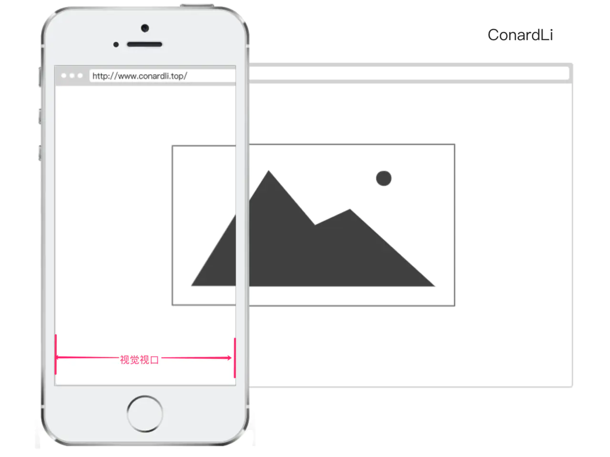

### 4.3 理想视口

布局视口在移动端展示的效果并不是一个理想的效果，所以理想视口(ideal viewport)就诞生了：网站页面在移动端展示的理想大小。
如上图，我们在描述设备独立像素时曾使用过这张图，在浏览器调试移动端时页面上给定的像素大小就是理想视口大小，它的单位正是设备独立像素。
上面在介绍 CSS 像素时曾经提到页面的缩放系数 = CSS 像素 / 设备独立像素，实际上说页面的缩放系数 = 理想视口宽度 / 视觉视口宽度更为准确。

所以，当页面缩放比例为 100%时，CSS 像素 = 设备独立像素，理想视口 = 视觉视口。

我们可以通过调用 screen.width / height 来获取理想视口大小。

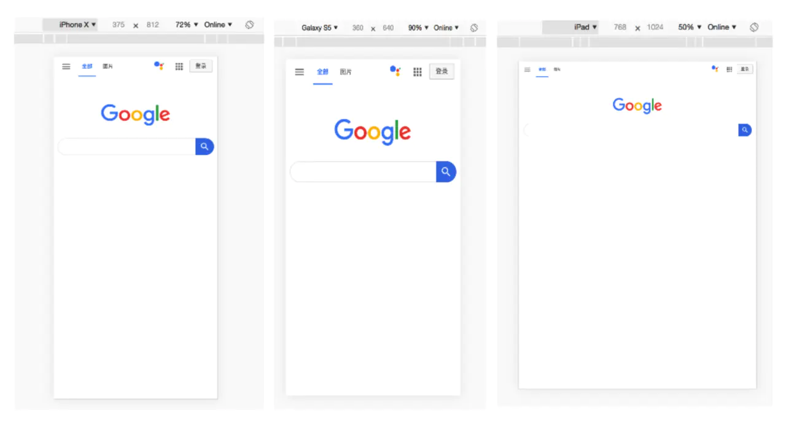

### 4.4 Meta viewport

<meta> 元素表示那些不能由其它HTML元相关元素之一表示的任何元数据信息，它可以告诉浏览器如何解析页面。

我们可以借助<meta>元素的 viewport 来帮助我们设置视口、缩放等，从而让移动端得到更好的展示效果。

```html
<meta
	name="viewport"
	content="width=device-width; initial-scale=1; maximum-scale=1; minimum-scale=1; user-scalable=no;"
/>
```

上面是 viewport 的一个配置，我们来看看它们的具体含义：

| `Value`         | 可能值                      | 描述                                                      |
| --------------- | --------------------------- | --------------------------------------------------------- |
| `width`         | 正整数或`device-width`      | 以`pixels`（像素）为单位， 定义布局视口的宽度。           |
| `height`        | 正整数或`device-height`     | 以`pixels`（像素）为单位， 定义布局视口的高度。           |
| `initial-scale` | `0.0 - 10.0`                | 定义页面初始缩放比率。                                    |
| `minimum-scale` | `0.0 - 10.0`                | 定义缩放的最小值；必须小于或等于`maximum-scale`的值。     |
| `maximum-scale` | `0.0 - 10.0`                | 定义缩放的最大值；必须大于或等于`minimum-scale`的值。     |
| `user-scalable` | 一个布尔值（`yes`或者`no`） | 如果设置为 `no`，用户将不能放大或缩小网页。默认值为 yes。 |

### 4.5 移动端适配

为了在移动端让页面获得更好的显示效果，我们必须让布局视口、视觉视口都尽可能等于理想视口。

device-width 就等于理想视口的宽度，所以设置 width=device-width 就相当于让布局视口等于理想视口。

由于 initial-scale = 理想视口宽度 / 视觉视口宽度，所以我们设置 initial-scale=1;就相当于让视觉视口等于理想视口。

这时，1 个 CSS 像素就等于 1 个设备独立像素，而且我们也是基于理想视口来进行布局的，所以呈现出来的页面布局在各种设备上都能大致相似。

## 五、移动端事件

### 5.1 事件类型

移动端事件列表

- touchstart 元素上触摸开始时触发
- touchmove 元素上触摸移动时触发
- touchend 手指从元素上离开时触发
- touchcancel 触摸被打断时触发

这几个事件最早出现于 IOS safari 中，为了向开发人员转达一些特殊的信息。

### 5.2 应用场景

touchstart 事件可用于元素触摸的交互，比如页面跳转，标签页切换

touchmove 事件可用于页面的滑动特效，网页游戏，画板

touchend 事件主要跟 touchmove 事件结合使用

touchcancel 使用率不高

注意：

- touchmove 事件触发后，即使手指离开了元素，touchmove 事件也会持续触发
- 触发 touchmove 与 touchend 事件，一定要先触发 touchstart
- <span style="color:#ee0b41">事件的作用在于实现移动端的界面交互</span>

### 5.3 事件绑定

方式一

```js
box.ontouchstart = function () {
	console.log('touch start')
}
```

方式二

```js
box.addEventListener('touchstart', function () {
	console.log('touch start')
})
```

这里推荐使用第二种，第一种有时会失灵。

### 5.4 点击穿透

<span style="color:#ee0b41"> touch 事件结束后会默认触发元素的 click 事件</span>，如没有设置完美视口，则事件触发的时间间隔为 300ms 左右，如设置完美视口则时间间隔为 50ms 左右。

如果 touch 事件隐藏了元素，则 click 动作将作用到新的元素上，触发新元素的 click 事件或页面跳转，此现象称为点击穿透

#### 5.4.1 解决方法

1. 阻止当前元素事件的默认行为。

```js
cls.addEventListener('touchstart', function (e) {
	e = e || event
	e.preventDefault()
})
```

问题：将来有很多元素要一个一个写，代码太多了

2. 阻止所有元素事件的默认行为。

```js
document.addEventListener('touchstart', function (e) {
	e = e || event
	e.preventDefault()
})
```

问题：因为禁止了所有元素默认行为，导致 a 标签不能跳转链接了

3. 给 a 标签添加跳转链接的方式

```js
var allA = document.querySelectorAll('a')

for (let i = 0; i < allA.length; i++) {
	const a = allA[i]
	a.addEventListener('touchend', function () {
		window.location.href = this.href
	})
}
```

问题：a 标签有误触

4. 解决误触

```js
var allA = document.querySelectorAll('a')

for (let i = 0; i < allA.length; i++) {
	const a = allA[i]
	a.addEventListener('touchmove', function () {
		this.isMove = true
	})
	a.addEventListener('touchend', function () {
		if (this.isMove) return
		window.location.href = this.href
	})
}
```

#### 5.4.2 fastclick

一个专门用于解决事件点透的库
仓库地址：https://github.com/ftlabs/fastclick

```html
<!-- 引入fastclick库 -->
<script src="https://as.alipayobjects.com/g/component/fastclick/1.0.6/fastclick.js"></script>
<!-- 使用fastclick库 -->
<script>
	if ('addEventListener' in document) {
		document.addEventListener(
			'DOMContentLoaded',
			function () {
				FastClick.attach(document.body)
			},
			false
		)
	}
</script>
```

## 六、单位

### 6.1 px

px 是像素值，是一个固定的长度

### 6.2 rem

是一个相对长度，相对于 html 标签的字体大小
比如：
html 标签的 font-size = 16px
1rem = 16px

### 6.3 em

是一个相对长度，相对于离它最近，包裹它标签的字体大小
比如：
默认情况下，浏览器字体大小为 16px `1em = 16px`
如果它父级元素设置 font-size = 18px `1em = 18px`
如果它本身设置 font-size = 20px `1em = 20px`

### 6.4 vw/vh

是一个相对长度，相对于整个屏幕。
整个屏幕平均分为 100 等分，横向（x 轴）分为 100vm，纵向（y 轴）分为 100vh
所以：50vm 就是整个屏幕宽度的一半

## 七、移动端常见问题

### 7.1 1px 像素问题

高清屏幕下 1px 对应更多的物理像素，所以 1 像素边框看起来比较粗，解决方法如下

1. 边框使用伪类选择器，或者单独的元素实现。例如底部边框

```css
.box2::after {
	content: '';
	height: 1px;
	width: 100%;
	position: absolute;
	left: 0;
	bottom: 0;
	background: #000;
}
```

2. 在高清屏幕下设置

```css
@media screen and (-webkit-min-device-pixel-ratio: 2) {
	.box2::after {
		transform: scaleY(0.5);
	}
}

@media screen and (-webkit-min-device-pixel-ratio: 3) {
	.box2::after {
		transform: scaleY(0.33333);
	}
}
```

### 7.2 iPhone X 刘海屏问题

iPhoneX 的出现将手机的颜值带上了一个新的高度，它取消了物理按键，改成了底部的小黑条，但是这样的改动给开发者适配移动端又增加了难度。

这些手机和普通手机在外观上无外乎做了三个改动：圆角（corners）、刘海（sensor housing）和小黑条（Home Indicator）。为了适配这些手机，安全区域这个概念变诞生了：安全区域就是一个不受上面三个效果的可视窗口范围。

为了保证页面的显示效果，我们必须把页面限制在安全范围内，但是不影响整体效果。

1. viewport-fit
   viewport-fit 是专门为了适配 iPhoneX 而诞生的一个属性，它用于限制网页如何在安全区域内进行展示。

   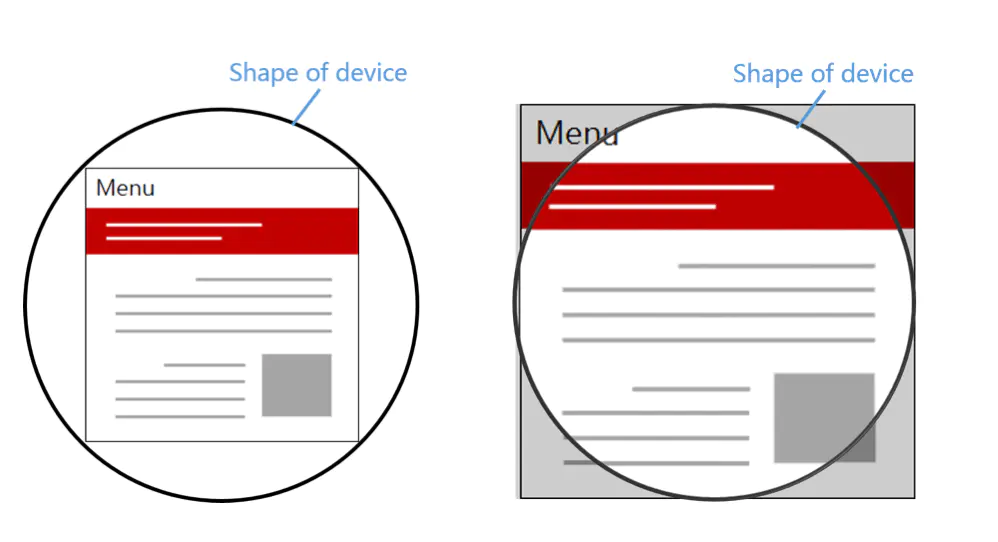

   contain: 可视窗口完全包含网页内容

   cover：网页内容完全覆盖可视窗口

   默认情况下或者设置为 auto 和 contain 效果相同。

### 7.3 高清图

```css
.avatar {
	background-image: url(sample.png);
	width: 300px;
	height: 200px;
}
@media only screen and (-webkit-min-device-pixel-ratio: 2) {
	.avatar {
		background-image: url(sample@2x.png);
	}
}
@media only screen and (-webkit-min-device-pixel-ratio: 3) {
	.avatar {
		background-image: url(sample@3x.png);
	}
}
```

### 7.4 适配

1. rem 适配
2. viewport 适配
3. flex
4. 百分比
5. 混合方案

### 7.5 真机测试

1. 通过 VSCODE liveServer 插件启动代码，得到访问地址：`http://127.0.0.1:5500/xxx.html`
2. 打开 cmd 窗口，输入`ipconfig` 得到当前电脑的 ip 地址: `192.168.1.15`
3. 让电脑和手机处于同一个 wifi 下
   比如：手机开热点，电脑连上热点。或者电脑开热点，手机连上电脑的热点。
4. 打开草料二维码网址：https://cli.im/url
5. 输入要转换的网址，**注意，要将 127.0.0.1 替换成真正的 ip 地址**，点击生成二维码
   `http://192.168.1.15:5500/xxx.html`
6. 打开手机浏览器，扫二维码访问
